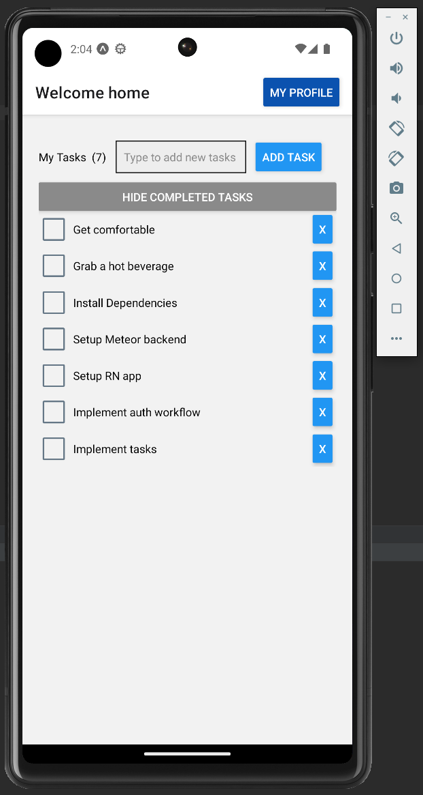

# Meteor React Native Starter

This is the final code repo for our workshop "Meteor and React Native" @ Meteor Impact 2022.
After post-editing it resulted in a complete starter repo. 🤩

[](https://standardjs.com)


> **Please note,** that I can't cover all operating systems out there.

## About

Meteor and React Native are not integrated with each other by default. 
However, there are great packages out there, that help us to make them integrate. 
The best is, it's actually not that difficult!

This starter brings the most basic integration for a Meteor project as a backend for your react native app.
Just follow the instructions in this readme to get startet immediately.



## Installation

You need to have Meteor installed on your system. 
Follow the Meteor installation instructions on [the Meteor website](https://meteor.com).

### Clone the repo and checkout the workshop branch

```bash
$ git clone git@github.com:jankapunkt/meteor-react-native-workshop.git
# If you have no ssh access to GitHub, please use
# https://github.com/jankapunkt/meteor-react-native-workshop.git
$ cd meteor-react-native-workshop
```

### Install and run the Meteor backend

```bash
$ cd backend
$ meteor npm install
$ meteor npm run start
```

The backend will install and start. If everything went fine, you should see the following message:

```bash
=> App running at: http://localhost:8000/
```

## Install and run the mobile app

Open a **new terminal** in order to install and run the app.
Starting from the project root, do the following:

```bash
$ cd app
$ meteor npm install
$ meteor npm run start
```

The console may prompt you to install expo-cli. If so, agree and continue.
If it does not ask you to install expo and the app fails to build, please manually install expo-cli via:

```bash
$ meteor npm install -g expo-cli
```

### Connect your mobile app to the backend

Connecting your app to the backend a bit more difficult, since you need to get your **local network ip**
in order to make the RN app connect. The Meteor-typical `localhost` will not work here.

First, get your local ip via

| os      | command        |
|---------|----------------|
| Linux   | `ip addr show` |
| MaxOs   | `ifconfig`     |
| Windows | `ipconfig`     |

Then replace the pattern `xxx.xxx.xxx.xxx` with the local ip from your network in `app/config.json`.

Finally, run your app via

```bash
$ cd app && meteor npm run start
```

After running, check the `app/.expo/settings.json` file and make sure it looks like the following:

```json
{
  "hostType": "lan",
  "lanType": "ip",
  "dev": true,
  "minify": false,
  "urlRandomness": "mc-y7b",
  "https": false,
  "scheme": null,
  "devClient": false
}
```

Now you should be good to go to continue your development!

## Install Expo Go on your development device

With the "Expo Go" app you are able to build your dev builds without further configuration or emulators.
You can also build cross-platform and test both Android and iOs without the need for Android SDK or XCode,
Expo covers all that for you.

If you still prefer an emulator, please install them on your own behalf.

## Get involved

You liked this workshop or used this repo as a starter? 
Please leave a star and help by contributing to [@meteorrn/core](https://github.com/meteorrn/meteor-react-native).

If you find issues within the code, please leave an issue.
Pull requests are welcomed, too!

If you have questions or problems with the installation, please leave an issue.

## License

MIT, see [LICENSE file](./LICENSE)
